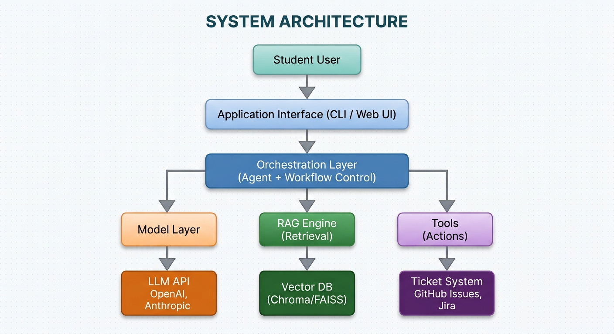

# System Architecture Specification

## 1. Executive Summary

This document defines the technical architecture for the **University Student-Support Case Agent** developed for the BSE4104 AI-Native & Agentic Engineering Capstone at Makerere University. The system is built on a hybrid architecture combining LLM-based agentic reasoning with strict deterministic boundaries. The agent handles intent understanding, document retrieval via Retrieval-Augmented Generation (RAG), synthetic case lookups, active-case conversational memory, and ticket creation/routing, while deterministic backend components enforce security, authentication, and execution boundaries.

---

## 2. Architecture Diagram

---

## 3. Layer Breakdown & Core Components

### 3.1 Presentation Layer

- **Student User:** Undergraduate students at Makerere University interacting with the system to inquire about academic procedures, check case statuses, or report issues (e.g., timetable clashes).
- **Application Interface (CLI / Web UI):** The primary user interface that handles request submission, renders grounded responses with source attributions, and enforces initial input sanitization.

### 3.2 Control & Orchestration Layer

- **Orchestration Layer (Agent + Workflow Control):**
  - Houses the central agentic reasoning engine, state management, and active-case conversational memory.
  - Evaluates user queries to route tasks across RAG search, case lookups, or support ticket generation.
  - Implements conversational context management to remember active support cases across dialogue turns.
  - Enforces explicit boundary checks to state when information is unavailable rather than generating unsupported answers.

### 3.3 Service & Execution Layer

#### A. Model Pipeline

- **Model Layer:** Responsible for prompt engineering, context assembly, grounding checks, and structured function-calling orchestration.
- **LLM API (OpenAI / Anthropic):** Provides foundation model capabilities for reasoning, intent extraction, and response synthesis bounded by strict system instructions.

#### B. Knowledge & Retrieval Pipeline (RAG)

- **RAG Engine (Retrieval):** Embeds incoming queries, manages similarity search strategies, and enforces source attribution over retrieved context.
- **Vector DB (Chroma / FAISS):** Stores vector embeddings of public Makerere University documents (handbooks, course outlines, academic guidelines, published timetables).

#### C. Tool & Action Pipeline

- **Tools (Actions):** Controlled function-calling modules executed deterministically.
  - _Case Lookup Tool:_ Retrieves synthetic student and support-case records.
  - _Ticket Creation & Routing Tool:_ Generates simulated support tickets for unresolved issues and routes them to department administrators or academic staff.
- **Ticket System (GitHub Issues / Jira / Local DB):** The underlying database and ticketing service storing synthetic student records, ticket histories, and routed support cases.

---

## 4. Data Flow & Security Boundaries

### Data Flow

1. **Query Submission:** A student submits a query via the Web UI/CLI.
2. **Intent & Memory Parsing:** The Orchestration Layer checks the active-case memory and determines if the request requires document grounding, case retrieval, or ticket creation.
3. **Execution Pathways:**
   - **Document Grounding:** Queries the RAG Engine → Searches Vector DB → Generates source-attributed response via Model Layer.
   - **Case Status Retrieval:** Triggers Case Lookup Tool → Queries synthetic case datastore → Returns case status to user.
   - **Escalation & Ticketing:** Triggers Support Ticket Tool → Creates/routes ticket in Ticket System → Updates active-case conversational memory.

### Deterministic Safety Boundaries

Following the core design principle—_the AI agent determines what information or tool is needed, while deterministic software enforces what the agent is permitted to do_:

- **Access Control:** Students can only access their own synthetic case records via deterministic authorization rules.
- **Out-of-Scope Operations:** High-impact administrative actions (admissions, grading changes, financial adjustments, or official record modifications) are strictly blocked at the API level.
- **Human Escalation:** Any request requiring institutional judgment is automatically routed as a support ticket to departmental human staff.
